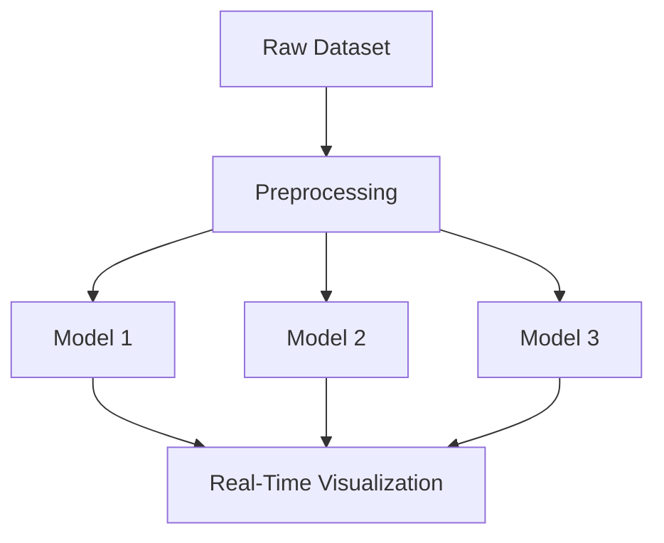

# 🚗 Dynamic Pricing for Urban Parking Lots
**Capstone Project — Summer Analytics 2025**  
Submitted by: vu23cs999@gmail.com

## 📌 Overview
This project simulates a dynamic pricing system for urban parking spaces using real-time data and intelligent pricing strategies.

## 🧰 Tech Stack
- Python
- Pandas, NumPy
- Bokeh (visualization)
- Geopy (location intelligence)
- Pathway (streaming-ready placeholder)

## 📊 Models
- Linear Model
- Demand-Based Model
- Competitive Pricing Model

## 🌐 Architecture Diagram

## 📂 Files
- Dynamic_Pricing.ipynb
- dataset.csv
- architecture_diagram.md

